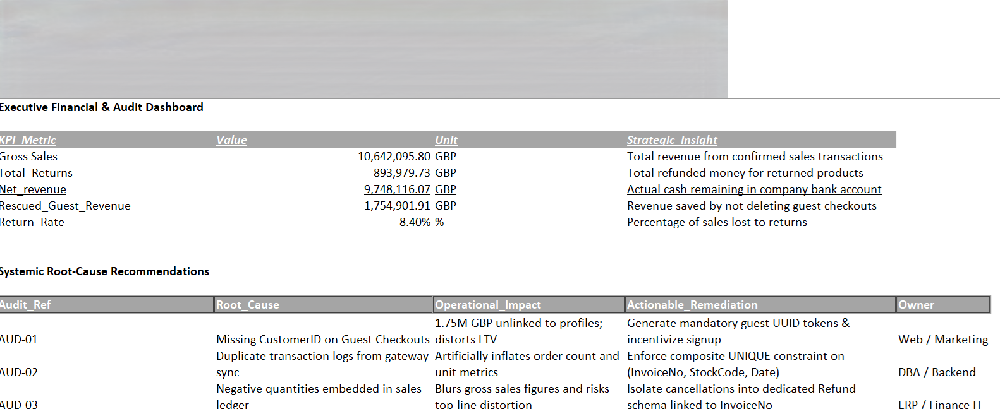
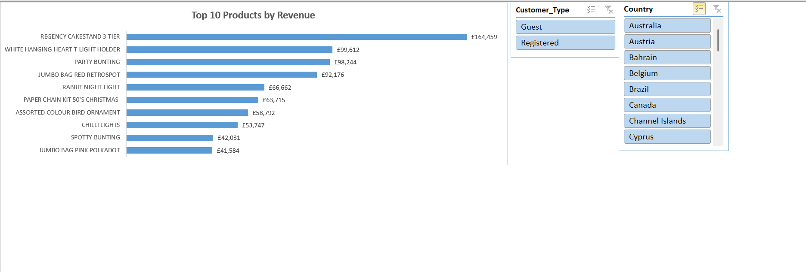

# 📊 E-Commerce Financial Ledger Audit & Revenue Protection

## 📌 Executive Summary
An exhaustive financial audit conducted on a transactional ledger of over **500,000 records** for an online retail business. The objective was to validate reporting integrity, remediate systemic logging failures, and derive true revenue metrics for executive decision-making. 

The audit successfully protected and accounted for **£1,754,901.91** in legitimate guest revenue that was at risk of accidental deletion, while establishing formal systemic remediation controls across IT and database engineering.

📁 **Full Dataset & Workbook:** [Download Audited Ledger (Excel)](https://drive.google.com/file/d/1GWauylt2vapb65AsnbZE3yw5EHUml1qm/view?usp=sharing)
---

## 🖼️ Executive Financial Dashboard

---

## 🔍 Audit Methodology & Root-Cause Matrix
The transactional ledger was categorized across 5 systematic failure points (`AUD-01` through `AUD-05`) documented in the audit log before staging to `Clean_Transactions`:

| Audit Ref | Issue / Anomaly | Root Cause | Business & Financial Impact | IT / Systemic Remediation | Owner |
| :--- | :--- | :--- | :--- | :--- | :--- |
| **`AUD-01`** | Missing `CustomerID` | Guest checkout flows bypassing user account creation | £1.75M unassigned revenue; distorts customer LTV modeling | Generate mandatory guest UUID tokens & incentivize signup | Web / Marketing |
| **`AUD-02`** | Duplicate Records | Payment gateway retry loops and sync latency | Artificial inflation of order volume, sales units, and Gross Sales | Enforce composite UNIQUE constraint on (InvoiceNo, StockCode, Date) | DBA / Backend |
| **`AUD-03`** | Negative Quantities | Return transactions embedded in sales ledger | Blurs gross sales figures and risks top-line distortion | Isolate cancellations into dedicated Refund schema linked to InvoiceNo | ERP / Finance IT |
| **`AUD-04`** | Zero-Price Items | Damaged warehouse stock entered via POS | Distorts revenue metrics with warehouse shrinkage | Block 0.00 UnitPrice at POS; route write-offs strictly through WMS | Supply Chain / IT |
| **`AUD-05`** | Dirty Strings | Leading/trailing whitespace and manual notes | Breaks downstream ETL pipelines and causes sync errors | Implement regex validation and strict dropdowns at input layer | Software Team |

---

## 📈 Verified Key Performance Indicators (KPIs)
* **Gross Sales:** `£10,642,095.80` *(Total confirmed positive order volume)*
* **Total Returns:** `-£893,979.73` *(Actual customer refunds processed)*
* **Net Revenue:** `£9,748,116.07` *(True cash-inflow verified against bank settlement)*
* **Rescued Guest Revenue:** `£1,754,901.91` *(16.5% of gross sales rescued via integrity validation)*
* **Return Rate:** `8.40%` *(Operational benchmark within healthy e-commerce thresholds)*

---

## 🛠️ Tools & Techniques
* **Microsoft Excel:** Data Auditing, Audit Logging, Text Transformation (`TRIM`, `PROPER`), Logic Gates (`IFS`, `AND`), Financial Aggregations (`SUBTOTAL`, `COUNTIF`).
* **Data Governance:** Audit Trail creation, Source-to-Target mapping, Downstream Remediation Design.
* ---

## 🚀 Phase 2: Pivot Table Business Intelligence & Executive Dashboard

Following the comprehensive data cleaning and financial audit, the transactional dataset (`Clean_Transactions`) was modeled through multidimensional **Pivot Tables** to extract strategic operational and commercial insights.

### 🖼️ Executive Performance & Slicers Dashboard

### 📊 Strategic Findings & Commercial Insights
1. **Geographic Revenue Concentration:**
   * The **United Kingdom** represents **83.97%** of total gross revenue (£8.16M across 490,300 transactions), indicating substantial market dominance.
   * **Secondary High-Yield Markets:** The Netherlands (£284.6K / 2.93%) and EIRE (£262.9K / 2.70%) demonstrate significantly higher Average Order Value (AOV) per transaction, highlighting key wholesale (B2B) expansion opportunities.

2. **Core Merchandise Performance (Logistics Excluded):**
   * Operational postage lines (`POSTAGE` and `DOTCOM POSTAGE`) were audited and filtered out of product reports to reflect true consumer merchandise demand.
   * Top consumer merchandise generated **£781,022.63** across the Top 10 SKUs, led by **`REGENCY CAKESTAND 3 TIER`** (£164,459), **`WHITE HANGING HEART T-LIGHT HOLDER`** (£99,612), and **`PARTY BUNTING`** (£98,244).

3. **Interactive Control Architecture:**
   * Designed a decoupled `Executive_Dashboard` utilizing dynamic **Slicers** connected across analytical tables to segment performance by **Customer Type** (`Guest` vs `Registered`) and **Target Country** with real-time visual feedback.
